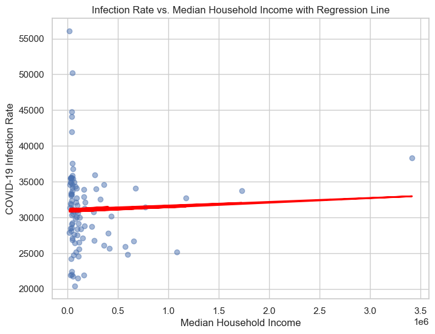
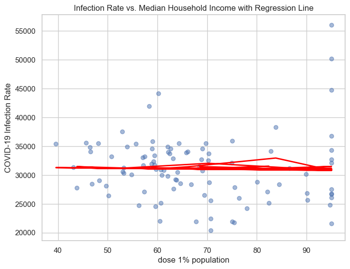
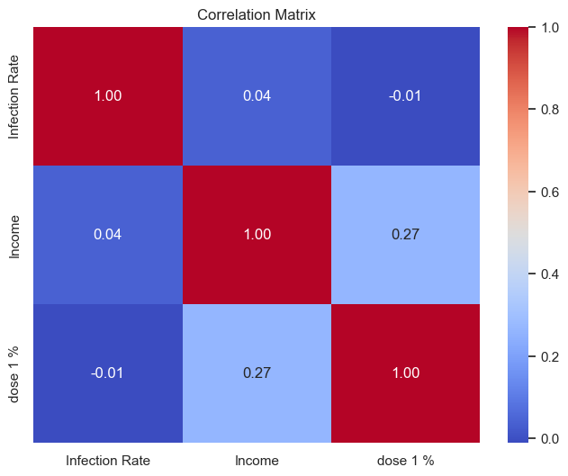
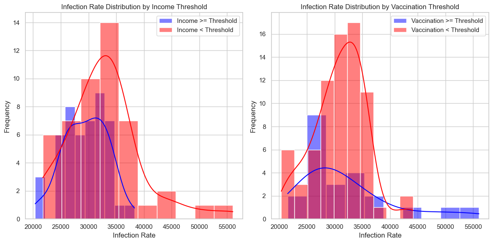

# Project
## Goal of analysis
The goal of this analysis is to investigate the impact of socioeconomic factors on COVID-19 infection rates at the county level in the United States. Specifically, we aim to understand how two key socioeconomic factors, "Median Household Income" and the "Percentage of Vaccinated Population," may be associated with the "COVID-19 Infection Rate."
## Measurment
The measurement for this analysis is the "COVID-19 Infection Rate." This rate is defined as the number of confirmed COVID-19 cases per 100,000 population in each county. It serves as an indicator of the prevalence of COVID-19 cases within a county, standardized to the population size.
## Two factors
1)Median household income
This factor represents the median household income in each county, measured in dollars ($). It is a proxy for the economic status or prosperity of the county. Higher median incomes typically suggest greater economic well-being. \
2)Percentage of Population vaccinated
This factor indicates the percentage of the population in each county that has received at least one dose of the COVID-19 vaccine. It reflects the level of vaccination coverage within a county, which can impact the spread and severity of COVID-19.
## Data collected
I have collected sample data for counties, including their COVID-19 Infection Rates, Median Household Incomes, and Percentages of Vaccinated Population from Census.gov and In class provided github data.
# Summary
1)Coefficient for Median Household Income (Income): The coefficient is approximately 0.0006, and the p-value is 0.676. This coefficient indicates a very weak and statistically insignificant positive relationship between the COVID-19 Infection Rate and Median Household Income. In other words, there is no significant impact of income on infection rates. \
2)Coefficient for Percentage of Population Vaccinated (Dose 1 %): The coefficient is -8.4235, and the p-value is 0.835. This coefficient suggests a very weak and statistically insignificant negative relationship between the COVID-19 Infection Rate and the Percentage of Population Vaccinated. It implies that there is no significant impact of vaccination rates on infection rates.
3)The obtained results further support the notion that the model does not effectively explain the variation in COVID-19 Infection Rates. Both the Median Household Income and Percentage of Population Vaccinated variables have very weak and statistically insignificant relationships with the Infection Rate.
# results
## Linear Reggresion results
 \
 \
 \
 

